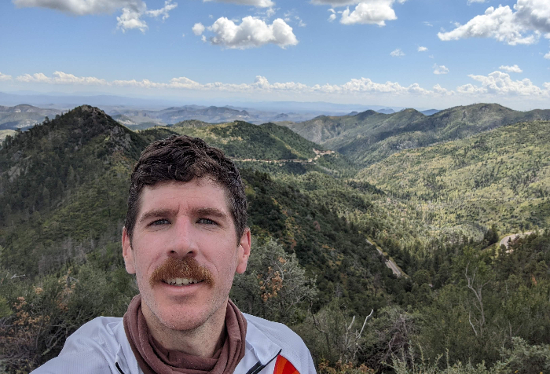

# About Me

  

**Some highlights...** \
👶 1985: Hello world! Grew up in Chester, VA \
💕 2004: Met Heather while working at Pocahontas State Park \
🎓 2007: Graduated from the University of Virginia; Moved to Greenville, SC \
🚐 2010: Moved to Charlotte, NC to start a new job \
🏠 2012: Moved back to Richmond \
🏔️ 2017: Hiked in the Canadian Rockies \
🇳🇱 2018: Experienced the Dutch countryside; Ate chocolate in Brussels \
🥐 2019: Inhaled pastries & coffee in Copenhagen; All the small towns on Bornholm \
💍 2020: Married Heather in Mathews, VA \
🚴‍♂️ 2022: Biked from San Diego, CA ➡ St. Augustine, FL for charity

<table border=0>
  <tr>
    <td>
      👶 1985: Hello world! Grew up in Chester, VA  
💕 2004: Met Heather while working at Pocahontas State Park  
📠2007: Graduated from the University of Virginia; Moved to Greenville, SC  
🚠2010: Moved to Charlotte, NC to start a new job  
🠠2012: Moved back to Richmond  
🏔️ 2017: Hiked in the Canadian Rockies  
🇳🇱 2018: Experienced the Dutch countryside; Ate chocolate in Brussels  
🥠2019: Inhaled pastries & coffee in Copenhagen; All the small towns on Bornholm  
💠2020: Married Heather in Mathews, VA  
🚴‍♂️ 2022: Biked from San Diego, CA ➡ St. Augustine, FL for charity
     </td>
    <td>
      
      </td>
  </tr>
</table>
